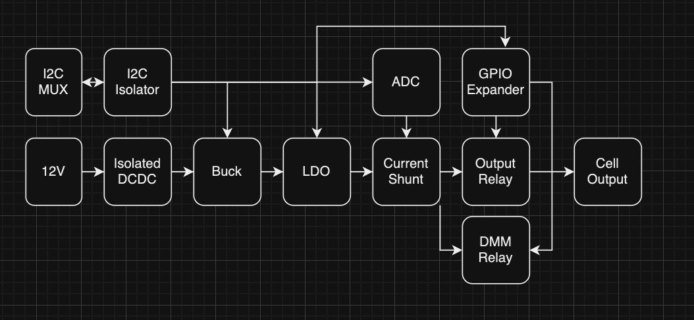
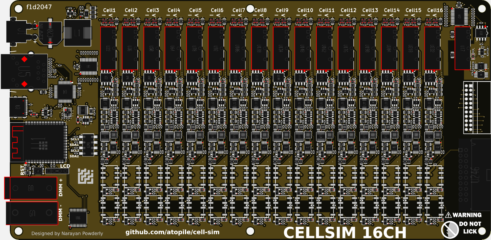
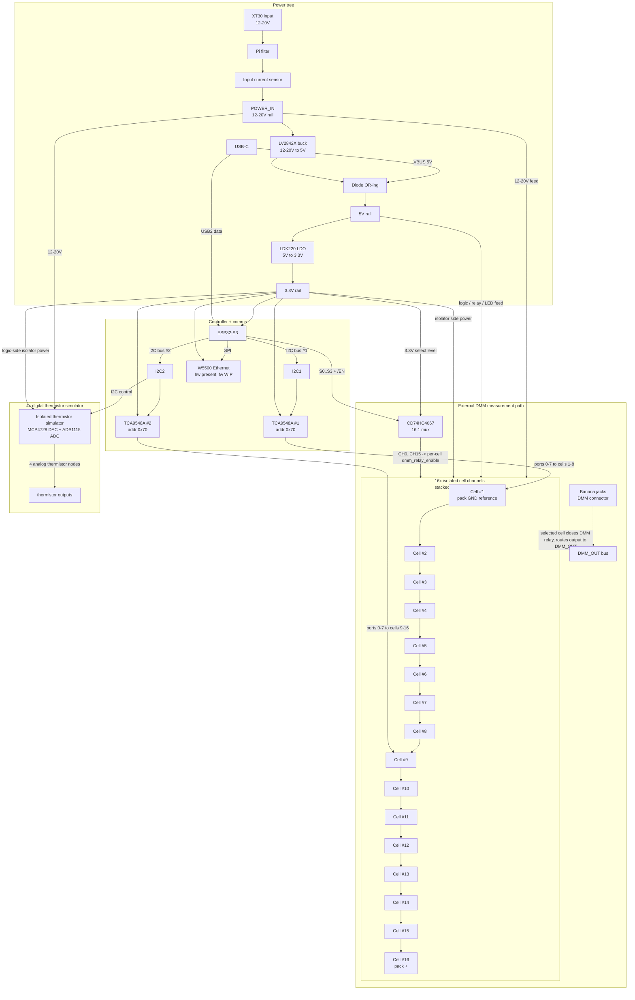
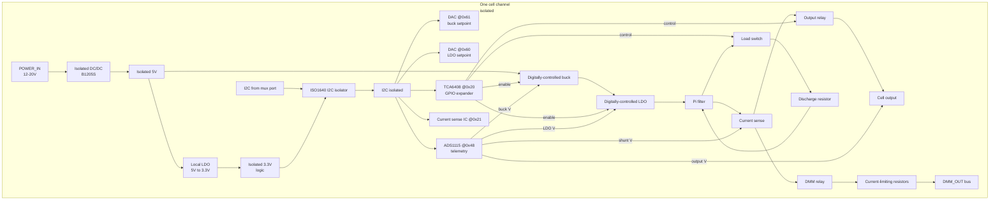
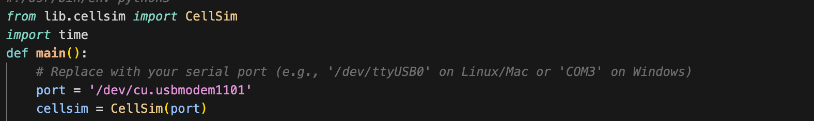
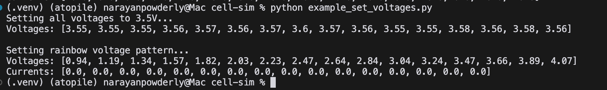
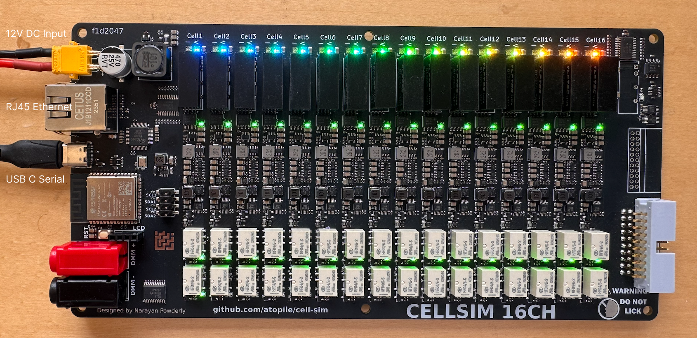

# Cell Simulator

This cell-sim is designed to mimic a LiPo battery pack for development of surrounding electronics (e.g. a BMS).

- 16 channels
- Open-Source hardware design, you can embed onto your own HIL setup
- ⚡️ 0-4.5V and 0-500mA per channel
- DMM muxed to each channel for arbitrarily precise measurement
- Open-circuit (open-wire) simulation on each channel
- 📏 16bit ADC feedback for voltage and current
- 🔌 USB w/ Python software interface (+ 100MBit Ethernet + WiFi waiting for firmware support)


## Documentation

- **Electronics**: this README (see diagrams below)
- **Software (firmware + Python)**: `SOFTWARE.md`

## Design overview





## How it works (electronics)

### System-level overview



### What a single cell channel does internally

Each channel is effectively an *isolated, digitally-controlled power supply* whose output is treated like a single LiPo cell. The channels are then wired in series to create a 16S “battery pack” at the output connector.



## Getting Started

1. Install python if you don't have it already
2. Install the requirements `pip install -r requirements.txt`
3. Connect the board via USB

4. Power the board with the 12V input (supply: 1A minimum, 3A recommended)
5. Run the example python script `python example_set_voltages.py`
6. Voltages should be set to 3.5V, then rainbow from 1V to 4V across the 16 channels and current should be close to 0A.



You should see something like this:


## Notes
1. To get best low noise performance, use a quality power supply for the input supply.

## Manufacturing
Board is intended to be manufactured with JLC, files are in the main directory of the repository.
Note, the highlighted isolated regulator needs to be depopulated:


## Firmware

### Update Firmware
We use PlatformIO to build and upload the firmware via USB.
1. Install PlatformIO: https://platformio.org/install
2. Connect the board via USB (might need to accept connection popup on Mac)
3. Run `pio run -t upload` or install the PlatformIO VSCode extension and use the upload button.

See `SOFTWARE.md` for firmware architecture, protocol, and troubleshooting.

## API Docs
### Connecting to cellsim

```python
from lib.cellsim import CellSim
cellsim = CellSim(port)
```

### Enable outputs
Each cell has a relay in series between the cell output and the connector, this can be  used to simulate open-wire faults for example.

```python
# Global enable/disable
cellsim.enableOutputAll()
time.sleep(1)
cellsim.disableOutputAll()
time.sleep(1)

# Enable/disable one at a time
# Turn relays on in a wave
for i in range(1, 17):
    cellsim.enableOutput(i)
    time.sleep(0.1)

time.sleep(1)

# Turn relays off in a wave
for i in range(1, 17):
    cellsim.disableOutput(i)
    time.sleep(0.1)
```

### Setting voltages
Each output voltage can be specified between 0.5V and 4.4V

```python
# Set all at once
cellsim.setAllVoltages(3.5)
time.sleep(1)

# Set one at a time
print("\nSetting rainbow voltage pattern...")
for i in range(16):
    voltage = 1.0 + (3.0 * i / 15)  # Spread 1V to 4V across 16 channels
    cellsim.setVoltage(i + 1, voltage)
```

### Measuring voltages (onboard)
Each channel has an onboard 16bit ADC that measures the cell output. Note this is not a kelvin connection to your DUT, the measurement will only be accurate when minimal current is being drawn by the DUT.

```python
voltages = cellsim.getAllVoltages()
print(f"Voltages: {[f'{v:.3f}' for v in voltages]}")
```
  
### Measuring voltages externally
To take a precision measurement, each channel has a multiplexed output that connects to the DMM connector via a relay.

```python
channel_to_measure = 3
# Enable DMM
cellsim.enableDMM(channel_to_measure)

# take measurment using external DMM
# that is connected to the DMM banana outputs
time.sleep(1)

cellsim.disableDMM()
```

### Load switch
Each channel has a resistor + mosfet across its output, this can be used to speed up the discharge of the output capacitors. For example when transitioning from a high output voltage to a low output voltage, there will be an RC decay time before the voltage settles, typically in the ~100ms range. Turning on the load switch will make this much faster.

```python
cellsim.enableLoadSwitchAll()
time.sleep(1)

cellsim.disableLoadSwitchAll()
time.sleep(1)
```

### Disconnecting session
Once your test is finished, you can use the following to close the serial session:
```python
  cellsim.close()
```
